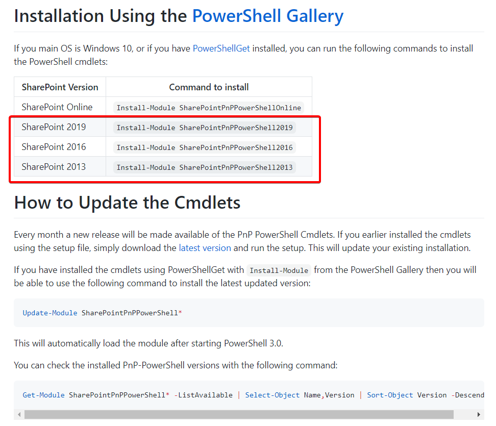

# EmailColumnsPnP ReadMe

This document describes the steps to deploy the OnePlace Solutions Email Columns
to a site collection. The deployment requires the use of PowerShell and
SharePoint Patterns and Practices (PnP) PowerShell cmdlets, or the new PnP.PowerShell cmdlets.

This script does **not** deploy Content Types. For Deploying Email Columns and Content Types simultaneously please see [ContentTypeDeploymentPnP](https://github.com/OnePlaceSolutions/ContentTypeDeploymentPnP).

## Pre-requisites

1.  Have either of the following SharePoint environments: SharePoint Online, SharePoint 2019 on-premises, SharePoint 2016 on-premises, SharePoint 2013 on-premises.

2.  PowerShell v3.0 or greater installed on your work environment. 

    If you are using Windows 10/8.1/Server 2012 you will already have a compatible version of PowerShell and can skip this point.
    
    If you are using Windows 7, this is preinstalled with PowerShell v2.0 and will need to be  upgraded. This can be done by [downloading and installing the Windows Management Framework 4.0](https://www.microsoft.com/en-au/download/details.aspx?id=40855). Download and install either the x64 or x86 version based on your version of Windows 7.

    > 

3.  (SharePoint On-Premise Only) The Legacy SharePoint PnP PowerShell cmdlets. 
    You will need to install only the the cmdlets that target your version of SharePoint on the machine you are running the script from. If you have installed the cmdlets previously using an MSI file these need to be uninstalled from Control Panel, but if you have installed the cmdlets previously using PowerShell Get you can update them with this command:
    ```
    Update-Module SharePointPnPPowerShell<version>
    ```
    
    For SharePoint On-Premises 2013/2016/2019 use this command to install the appropriate PnP Cmdlets via PowerShell Get:
    ```
    Install-Module SharePointPnPPowerShell<version>
    ```
    > 

4.  (SharePoint Online Only) (Multi-Tenant supported) [The latest PnP.PowerShell](https://pnp.github.io/powershell/articles/installation.html) installed on the machine you are running the script from. You can run the below command in PowerShell (as Administrator) to install it. 

    Install new PnP.PowerShell Cmdlets:
    ```
    Install-Module -Name "PnP.PowerShell"
    ```
    Note that you will need to ensure you have uninstalled any previous 'Classic' or Legacy PnP Cmdlets prior to installing this. If you have installed the cmdlets previously using an MSI file these need to be uninstalled from Control Panel, but if you have installed the cmdlets previously using PowerShell Get you can uninstall them with this command (as Administrator):

    ```
    Uninstall-Module "SharePointPnPPowerShellOnline" -Force -AllVersions
    ```
    
    *PnP Management Shell access needs to be granted for this script, but this can be revoked in Azure Active Directory when you no longer need to run the script.*
    -->
5.  (Optional, SharePoint Online Only) Content Type Hub Administrator Access
    If you wish to use the Email Site Columns in a Site Content Type deployed using the [Content Type Gallery in SharePoint Online](https://docs.microsoft.com/en-us/sharepoint/create-customize-content-type), you will need Administrative permissions on the Site Collection itself that supports this feature at 'https://<yourTenant>.sharepoint.com/sites/contenttypehub' (being a Global Administrator is not sufficient, you must explicitly navigate to this Site Collection and name your account as a Site Collection Administrator/Owner). You can then enter this Site Collection URL in Step 3 of the script and continue on to using the Content Type Gallery after the script has finished.

## Offline Scripting

If you have limited ability to run scripts from the internet in your environment, please download  [EmailColumnsPnPOfflineBundle.zip](https://github.com/OnePlaceSolutions/EmailColumnsPnP/raw/master/EmailColumnsPnPOfflineBundle.zip) above from this repo and extract all contents to one folder. Run the PowerShell script from that folder and it will recognize the XML file containing the Email Columns configuration is present. You can then continue from Step 3 below.

## Deploying


1.  Start PowerShell on your machine:

    

2.  Copy and paste the following command into your PowerShell command
    window and hit enter:

    > **Invoke-Expression (New-Object
    > Net.WebClient).DownloadString(‘https://raw.githubusercontent.com/OnePlaceSolutions/EmailColumnsPnP/master/installEmailColumns.ps1’)**
    >
    > Copy the text above, then in the PowerShell window right click at the
    > cursor and the command will be pasted into the window, then hit the
    > enter key to execute the command:

    

3.  The PowerShell script will execute and prompt you to enter the Site
    Collection Url for the Site Collection you wish to deploy the Email
    columns to. You can either type it in or copy and paste the url into
    the command window and hit enter:

    

    

4.  You will be asked to enter your credentials for SharePoint. For
    SharePoint Online it will be your email address, for on-premise it
    will your domain\\username:

    

5.  The email columns template will then be downloaded and applied to
    your site collection:

    

    

6.  Repeat from step 2 above for any other Site Collections. If at a
    later date you need to update the OnePlace Solutions Email columns,
    perform the steps from step 2 and any modifications to existing
    columns will be applied as well as the addition of any new email
    columns we add.


