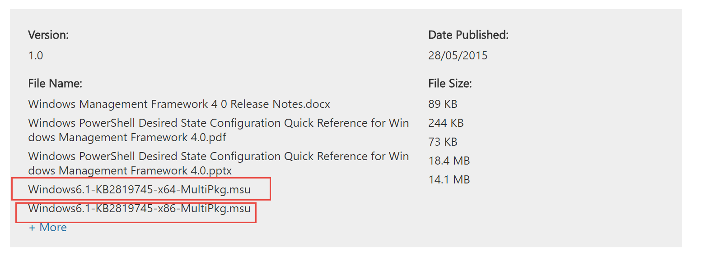
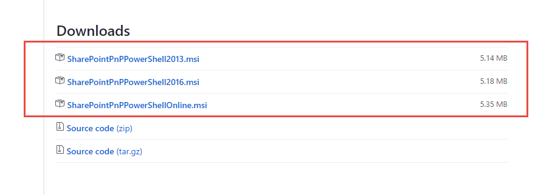
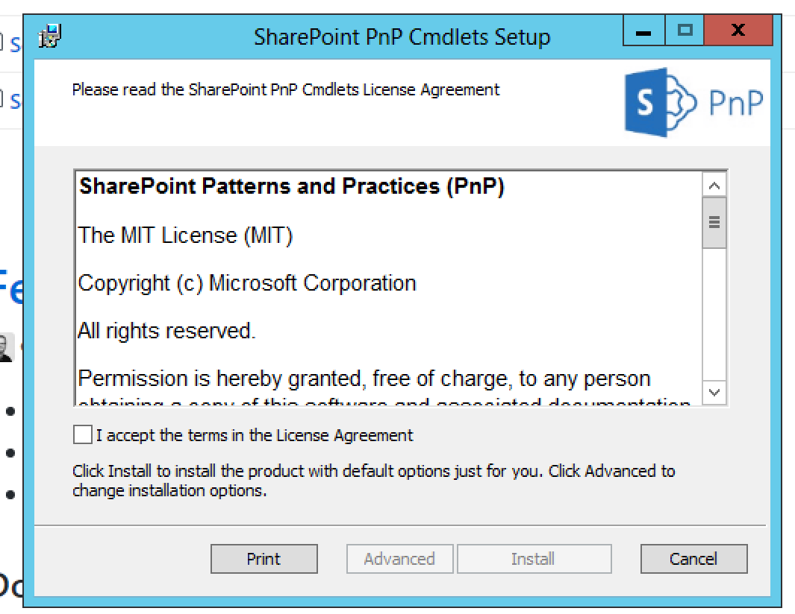
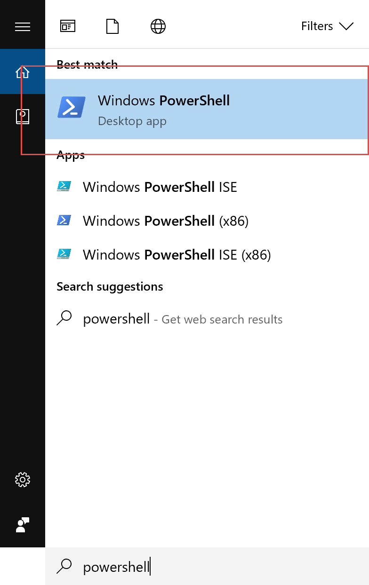
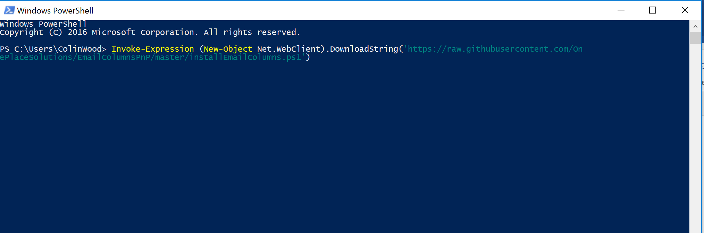
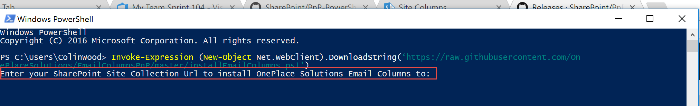
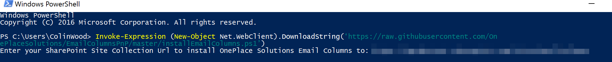
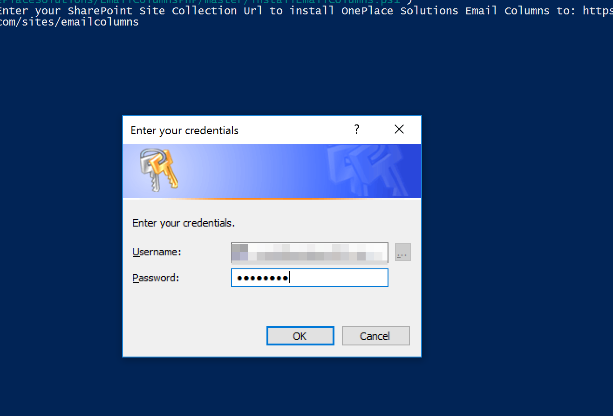
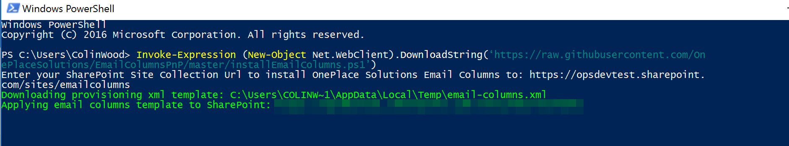
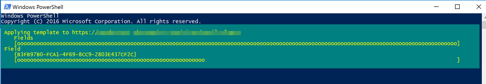

Deploy OnePlace Solutions Email Columns to a Site Collection
============================================================

This document describes the steps to deploy the OnePlace Solutions Email Columns
to a site collection. The deployment requires the use of PowerShell and
SharePoint Patterns and Practices (PnP) PowerShell cmdlets.

This script does **not** deploy Content Types. For Deploying Email Columns and Content Types simultaneously please see [ContentTypeDeploymentPnP](https://github.com/OnePlaceSolutions/ContentTypeDeploymentPnP).

Pre-requisites
--------------

1.  SharePoint Online, SharePoint 2019 on-premise, SharePoint 2016 on-premise, or SharePoint 2013
    on-premise.

2.  PowerShell v3.0 or greater installed on the machine. Windows 10/8.1
    and Windows Server 2012 and greater are all ready to go. Windows 7
    is preinstalled with v2.0 of PowerShell. PowerShell needs to be
    upgraded on Windows 7 machines. This can be done by downloading and
    installing the Windows Management Framework 4.0 from here:
    <https://www.microsoft.com/en-au/download/details.aspx?id=40855> .
    Download and install either the x64 or x86 version based on your
    version of Windows 7:

    

3.  Install the SharePoint PnP PowerShell cmdlets on your
    machine. You need to install the correct version of the cmdlets to
    target your version of SharePoint. Install the June 2020 release msi
    files from here:
    <https://github.com/pnp/PnP-PowerShell/releases/tag/3.22.2006.2>.

You will need to logon as a local Administrator to your machine to
install the msi file:

Offline Scripting
--------------------------------------

If you have limited ability to run scripts from the internet in your environment, please download  [EmailColumnsPnPOfflineBundle.zip](https://github.com/OnePlaceSolutions/EmailColumnsPnP/raw/master/EmailColumnsPnPOfflineBundle.zip) above from this repo and extract all contents to one folder. Run the PowerShell script from that folder and it will recognize the XML file containing the Email Columns configuration is present. You can then continue from Step 3 below.

Installing Email Columns to SharePoint
--------------------------------------

1.  Start PowerShell on your machine:

    

2.  Copy and paste the following command into your PowerShell command
    window and hit enter:

    > **Invoke-Expression (New-Object
    > Net.WebClient).DownloadString(‘https://raw.githubusercontent.com/OnePlaceSolutions/EmailColumnsPnP/master/installEmailColumns.ps1’)**
    >
    > Copy the text above, then in the PowerShell window right click at the
    > cursor and the command will be pasted into the window, then hit the
    > enter key to execute the command:

    

3.  The PowerShell script will execute and prompt you to enter the Site
    Collection Url for the Site Collection you wish to deploy the Email
    columns to. You can either type it in or copy and paste the url into
    the command window and hit enter:

    

    

4.  You will be asked to enter your credentials for SharePoint. For
    SharePoint Online it will be your email address, for on-premise it
    will your domain\\username:

    

5.  The email columns template will then be downloaded and applied to
    your site collection:

    

    

6.  Repeat from step 2 above for any other Site Collections. If at a
    later date you need to update the OnePlace Solutions Email columns,
    perform the steps from step 2 and any modifications to existing
    columns will be applied as well as the addition of any new email
    columns we add.

